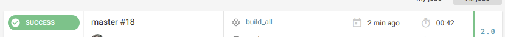
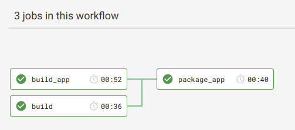
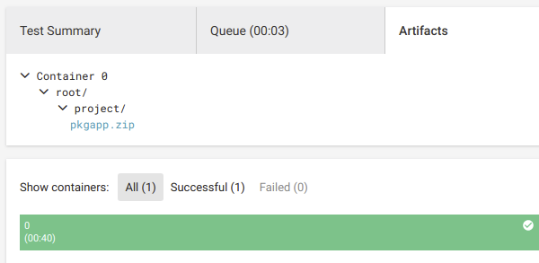

# Ledger EOS (Integration Repo)

[](https://circleci.com/gh/ZondaX/ledger-eos) [](https://opensource.org/licenses/Apache-2.0)

This project wraps the Ledger Nano S app for EOS and provides continuous integration via CircleCI.

An artifact (zip) containing a compile app package will be created for each PR.

**WARNING: Remember to use this ONLY in a ledger without funds and only for testing purposes.**

## Installing

There are two ways you can install the app:

### Getting the package

There are two ways you can get the package. (*This workflow will be improved in the future*)

#### Option 1. via CircleCI Dashboard

Go to CircleCI dashboard https://circleci.com/gh/ZondaX/ledger-eos

Go to the latest build and click in `build_all`



You will see the build job dependencies. Click in `package_app`



Now, go to artifacts. Expand the container directory until you find the `pkgapp.zip` file and download it.




#### Option 2. Use REST API and get a the directly link to the latest package

Click in the following link

https://circleci.com/api/v1.1/project/github/ZondaX/ledger-eos/latest/artifacts

This will return something similar to:

```json
[ {
  "path" : "root/project/pkgapp.zip",
  "pretty_path" : "root/project/pkgapp.zip",
  "node_index" : 0,
  "url" : "https://15-173824944-gh.circle-artifacts.com/0/root/project/pkgapp.zip"
} ]
```

Download the zip file from the URL you get back.

### Running the script

1. Unzip the file
2. You will find a bash script called `loadapp.sh`
3. Connect your ledger and enter the password
4. Run the script
   - Because the app is a development build and it has not been signed by ledger, it will tell you that the app is not trusted
   - NEVER INSTALL THIS APP IN A LEDGER WITH FUNDS. USE A TEST LEDGER FOR DEVELOPMENT PURPOSES 
   - accept and install

**The app will be named EosDemo with version 0.0.0. This is intentional**
